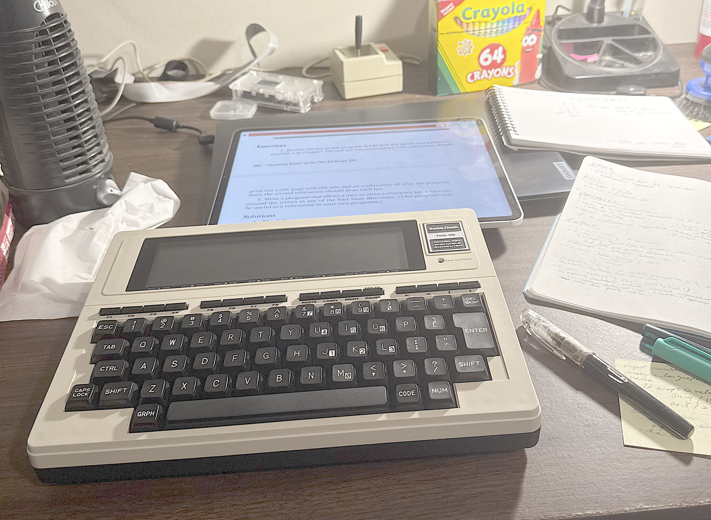

# Retro Programming for the Modern(ish) Software Developer

_(just want the book?  Get it here: [Modern Retro.pdf](Modern%20Retro.pdf))_

You've used IDEs, programmed in typesafe langauges with highly
featured rich standard libraries, and huge amount of complexity.

You've seen (or grew up with) the older computer systems that do way less, but look like
they're a huge amount of fun.  Nothing gets in the way between you and being able
to exploit all the hardware, and being able to push the hardware far beyond what the
original creators envisioned.

I grew up with the Apple ][, Apple //e, and early Mac.  I learned to program from code
listings from magazines (and debugging the errors I typed in), and had a huge amount
of fun, enough to make me want to program for a living (having to choose between
music and programming as I was leaving high school).

I want to share some of the fun, pain, glory, and enjoyment that comes from programming
these older machines.

All of the prose work is happening inside of the [Scrivener
Document](https://www.literatureandlatte.com). Not sure how I'll
represent the coding portions.  Lord knows, I might create this repo and then
never touch it again...

| Böb is having difficulty with BASIC dialects | TRS-80 Model 100 research |
| --- | ---
|  |  |

# LICENSE

This uses the "[AI0 Attribution Non Commercial No Derivatives License](https://www.humanscommons.org/license/ai0-by-nc-nd/1.0)". The big thing is the AI0 part - specifically _"The licensor wishes to allow every person to freely copy, distribute, display, perform, and transform the licensed material, provided that such use is carried out entirely by a Human and not by any AI-driven or automated system."_ - Humans only.  It's a license violation to glom this stuff into an LLM.  If you would like to compensate me for glomming this stuff into an LLM, feel free to contact me.

(not that this will do any good, but I would like for my words to be
read without being homogenized with the rest of the internet)

